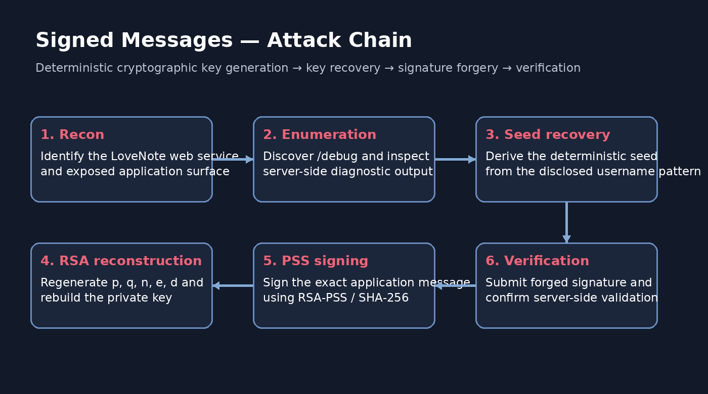
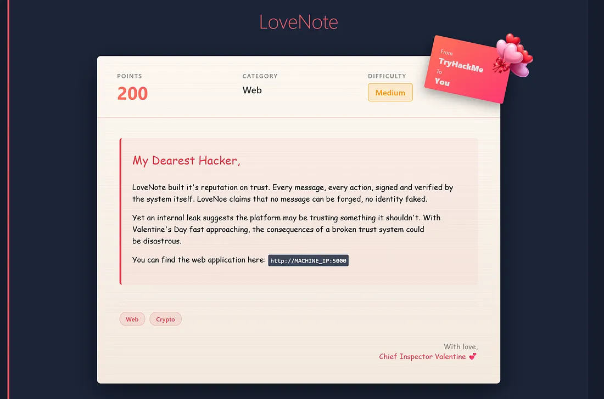
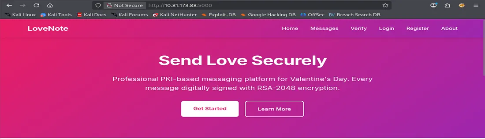
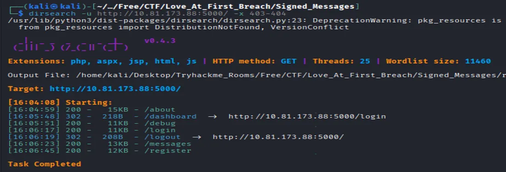
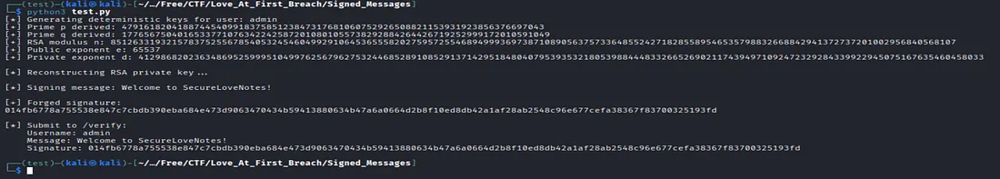
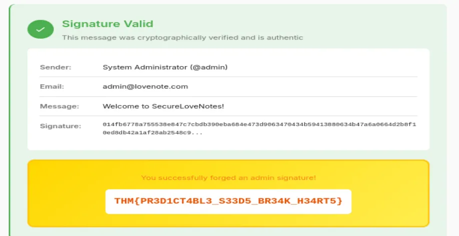

# Signed Messages — Security Assessment Walkthrough

> **Challenge:** Signed Messages  
> **Room:** Love at First Breach  
> **Platform:** TryHackMe  
> **Classification:** Web Application + Cryptography  
> **Difficulty:** Medium

## 1. Executive Summary

The target is a web application named **LoveNote**. The application claims to provide trustworthy, cryptographically signed messages using a PKI-backed design.

The weakness is not a conventional web injection. Instead, the application's cryptographic trust model is undermined by **deterministic key generation** combined with an exposed **debug endpoint**.

The debug information reveals the seed construction and prime-generation process. Once the username and deterministic derivation formula are known, the RSA private key can be reconstructed locally. A valid RSA-PSS signature can then be generated for a message selected from the application's message store and submitted to the verification endpoint.

The result is a forged signature accepted as authentic by the application.



## 2. Scope and Safety

Testing in this document is limited to the intentionally vulnerable TryHackMe machine associated with the challenge.

Do not reuse these techniques against real services without explicit authorization.

## 3. Objectives

The assessment objectives are to:

1. Identify the exposed web surface.
2. Discover information disclosure through application enumeration.
3. Determine how cryptographic key material is generated.
4. Reconstruct the server's RSA private key.
5. Reproduce the exact signature scheme expected by the verifier.
6. Demonstrate signature forgery.
7. Validate the result through the application's verification workflow.

## 4. Initial Reconnaissance

The room provides a LoveNote web application hosted on the assigned target machine.

The landing page identifies the service as a professional PKI-based messaging platform and claims that messages are digitally signed.



The important initial observation is that the UI establishes **trust in a cryptographic signing system**. That makes the verification workflow a high-value target: rather than trying to bypass the web interface directly, the assessment should determine whether the trust mechanism itself can be subverted.

## 5. Understanding the Application

The main application exposes several obvious routes, including:

- `/`
- `/about`
- `/dashboard`
- `/login`
- `/messages`
- `/register`
- `/verify`

The message area is especially important because it provides content that the server considers authentic.



At this stage the working hypothesis is:

> If the server's signing key can be reconstructed or predicted, the verifier may accept a signature that was never produced by the legitimate application workflow.

## 6. Web Enumeration

Directory enumeration was used to discover additional application functionality.

Example workflow:

```bash
dirsearch -u http://TARGET:5000/ -e php,aspx,jsp,html,js
```

Enumeration revealed an exposed `/debug` route.



This endpoint became the pivot point of the entire challenge.

## 7. Debug Disclosure

The debug output reveals implementation details that should never be exposed by a production cryptographic service.

The relevant information includes:

```text
Development mode: ENABLED
Using deterministic key generation
Seed pattern: {username}_lovenote_2026_valentine

Seed converted to bytes
Seed hashed using SHA256
Prime p derived from SHA256(seed)
Prime q derived from SHA256(seed + b"pki")
RSA modulus generated from p × q
RSA key pair constructed
Public and private keys saved to disk
```



This creates a reproducible key-generation function.

### 7.1 Root Cause

A secure private key must depend on unpredictable randomness.

Here, the server derives prime candidates from a predictable string:

```text
{username}_lovenote_2026_valentine
```

The transformation is deterministic:

```text
seed = username + "_lovenote_2026_valentine"
p = nextprime(int(SHA256(seed)))
q = nextprime(int(SHA256(seed + "pki")))
```

Once the username is known, the same prime values can be reproduced.

## 8. Important Cryptographic Detail

The application presentation claims RSA-2048, but the disclosed derivation process changes the practical security picture.

A SHA-256 digest is only 256 bits wide. Feeding that digest directly into an integer and calling `nextprime()` produces primes of approximately the digest's size rather than true 1024-bit RSA primes.

Therefore:

```text
SHA-256 output
      ↓
~256-bit integer
      ↓
nextprime()
      ↓
~256-bit p / q
      ↓
~512-bit modulus
```

The security failure is therefore twofold:

1. **Predictability:** the primes can be recomputed.
2. **Weak size:** the generated modulus is materially smaller than a genuine RSA-2048 key.

The exact effective key size should always be established from the implementation, not a label in the UI.

## 9. Reconstructing the RSA Parameters

The disclosed process can be reproduced with Python using `hashlib`, `sympy` and `cryptography`.

A clean reproduction model is:

```python
import hashlib
from sympy import nextprime

username = "admin"
seed = f"{username}_lovenote_2026_valentine".encode()

p = nextprime(int.from_bytes(
    hashlib.sha256(seed).digest(),
    byteorder="big"
))

q = nextprime(int.from_bytes(
    hashlib.sha256(seed + b"pki").digest(),
    byteorder="big"
))

n = p * q
phi = (p - 1) * (q - 1)
e = 65537
d = pow(e, -1, phi)
```

This recovers the mathematical RSA private exponent:

```text
d = e⁻¹ mod φ(n)
```

The resulting parameters are sufficient to construct a valid RSA private key object locally.

## 10. Rebuilding the Private Key

When using the Python `cryptography` package, the RSA CRT values can be reconstructed as:

```python
dmp1 = d % (p - 1)
dmq1 = d % (q - 1)
iqmp = pow(q, -1, p)
```

The private key is then built from the recovered RSA components.

This is not a brute-force attack. It is a **key-reproduction attack** caused by deterministic key generation.

## 11. Matching the Signature Scheme

Recovering the RSA key is only half of the problem.

The verifier also expects a particular signature format. The challenge uses RSA-PSS with SHA-256.

The compatible signing configuration is:

```python
from cryptography.hazmat.primitives.asymmetric import padding
from cryptography.hazmat.primitives import hashes

signature = private_key.sign(
    message.encode(),
    padding.PSS(
        mgf=padding.MGF1(hashes.SHA256()),
        salt_length=padding.PSS.MAX_LENGTH
    ),
    hashes.SHA256()
)
```

The signature is then encoded as hexadecimal for submission.

### 11.1 Why Exact Parameters Matter

RSA-PSS is parameter-sensitive.

A mathematically valid RSA signature generated with an incompatible salt length or digest configuration may still be rejected by the application's verifier.

Therefore the exploit requires reproducing the verifier's cryptographic expectations, not merely producing an RSA signature.

## 12. Selecting the Target Message

The `/messages` functionality exposes a server-generated message suitable for testing the signing workflow.

The important point is that the attacker should sign the **exact message bytes** expected by the verifier.

Conceptually:

```text
Target username
      +
Exact server-recognized message
      +
Recovered private key
      ↓
Valid RSA-PSS signature
```

Changing even one character in the signed message changes the digest and invalidates the signature.

## 13. Forging the Signature

The final exploit chain is:

1. Use the known account name.
2. Recreate the deterministic seed.
3. Derive `p` and `q`.
4. Calculate `n`, `φ(n)` and `d`.
5. Rebuild the private RSA key.
6. Sign the exact target message with RSA-PSS/SHA-256.
7. Submit the username, message and forged signature to `/verify`.

This converts the application's signature-verification mechanism from a trust boundary into an attacker-controlled signing primitive.

## 14. Verification

The verification response confirms that the message is accepted as authentic and identifies the sender as the administrator account.



This demonstrates the complete vulnerability path:

```text
Information Disclosure
        ↓
Predictable Seed
        ↓
Deterministic Prime Generation
        ↓
Recoverable RSA Private Key
        ↓
Attacker-Controlled Signature
        ↓
Verifier Accepts Forged Message
```

## 15. Challenge Result

The final challenge token has been intentionally **redacted** from this public portfolio write-up.

> **Flag:** `THM{REDACTED_FOR_PUBLICATION}`

This keeps the repository suitable for a public learning portfolio while preserving the technical reproduction path.

## 16. Root Cause Analysis

### Primary vulnerability

**Deterministic cryptographic key generation**

The server's private signing key is reproducible from public or discoverable application inputs.

### Contributing weaknesses

**Sensitive debug endpoint exposure**  
Implementation details disclose the exact derivation process.

**Misleading key-strength claims**  
The interface suggests RSA-2048, while the observed derivation process produces much smaller factors.

**Insufficient separation between development and production behavior**  
The debug mode exposes cryptographic internals that would normally remain inaccessible.

## 17. Security Impact

Successful exploitation compromises the core security properties the application is designed to provide.

An attacker capable of reconstructing the private signing key may be able to:

- forge messages for trusted identities;
- impersonate administrative users within the signing system;
- defeat message authenticity checks;
- undermine non-repudiation assumptions;
- generate signatures that the verifier considers legitimate.

## 18. Remediation

### Use a cryptographically secure random source

RSA primes must be generated using a CSPRNG-backed key-generation implementation.

Do not derive secret key material from usernames, timestamps, static strings or predictable application state.

### Disable debug endpoints in production

Debugging interfaces should be removed, access-controlled, or isolated from production deployments.

### Enforce real key-size guarantees

If RSA-2048 is required, use a well-tested library API that generates genuine 2048-bit keys rather than constructing the key from a 256-bit hash.

### Protect private keys

Private signing keys should be stored using appropriate key-management controls, with restricted file permissions and controlled application access.

### Add cryptographic regression tests

The application should test:

- actual modulus size;
- unpredictability of key generation;
- correct PSS parameters;
- key rotation;
- rejection of malformed or attacker-controlled signatures.

## 19. Lessons Learned

This challenge demonstrates a particularly important security principle:

> **Cryptography fails when key management fails.**

A strong signature algorithm cannot compensate for predictable private-key generation.

The most valuable assessment clue was not the branded UI or the claimed RSA-2048 configuration. It was the debug output describing how the server actually generated the key.

The practical methodology was therefore:

```text
Trust the implementation evidence.
Question the security claims.
Reconstruct the cryptographic process.
Validate the exploit end-to-end.
```

## 20. Evidence Summary

| Phase | Evidence | Security Significance |
|---|---|---|
| Reconnaissance | LoveNote web application | Defines attack surface |
| Enumeration | `/debug` discovered | New high-value endpoint |
| Debugging | Deterministic seed pattern | Predictable key generation |
| Key analysis | SHA-256 → `nextprime()` | Weak/reproducible RSA factors |
| Reconstruction | `p`, `q`, `n`, `d` recovered | Private signing capability |
| Forgery | RSA-PSS/SHA-256 signature | Attacker-generated authentic signature |
| Verification | Signature accepted by `/verify` | Trust boundary compromised |

## 21. Conclusion

The Signed Messages challenge is a concise demonstration of how application design can invalidate otherwise sound cryptographic primitives.

The attack does not require breaking RSA mathematically. Instead, it exploits deterministic implementation choices and excessive debug disclosure to reproduce the server's own signing key.

From a security-assessment perspective, the critical workflow was:

**enumerate → inspect → model → reproduce → forge → verify**

That chain is the core technical lesson of the room.
